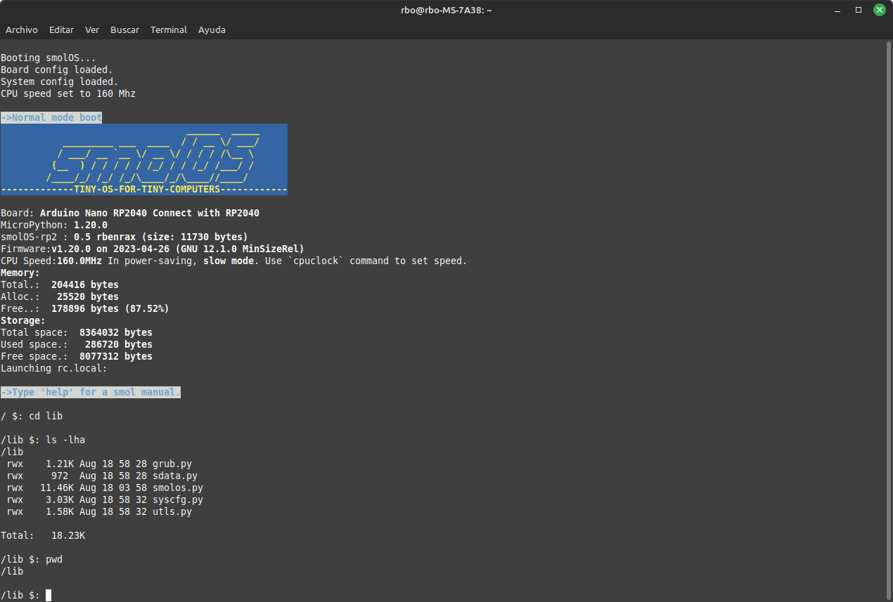

# smolOS

smolOS - a tiny and simple operating system for MicroPython (targetting ESP8266, RP2040, ESP32-C3, ETC.) giving the user POSIX-like environment to play by Krzysztof Krystian Jankowski.

[smolOS original github site](https://github.com/w84death/smolOS/tree/main)

[smolos docs site](http://smol.p1x.in/os/)

This is a simple test implementation with some modifications of smolOS over ESP32-C3/YD-RP2040 by rbenrax.

Luatos esp32-c3

VCC-GND Studio YD-2040

TODO List:

X Grub will be the first process in boot, will create .board file in /etc directory if does not exists, this file shoud be edited to acomodate all the board resources available, if the .board file exists, system process smolos will read its content and will enable the resources to be used by the system, modules, lshw, etc.

- Add smolos base class for programs and modules.
  
- Add /lib/mod, will contain all modules inherit from basemod.py and will recieve refs from kernel, ex. board resources, wifi, etc.
When system boots will call the modules to test resources available in the board definition.

X add smolos.conf in /etc directory, will contain system configutation parameters.
  
- Enhance ls command
- Editor to external .py
- Add regexp and directories to file managements
- Add Wifi client and AP
- Add grep, du, diff, find, tar, ping, ip, uname, hostname and wget.
- Hidden files
- /etc/rc.local
- 

Wishlist is open ;)

