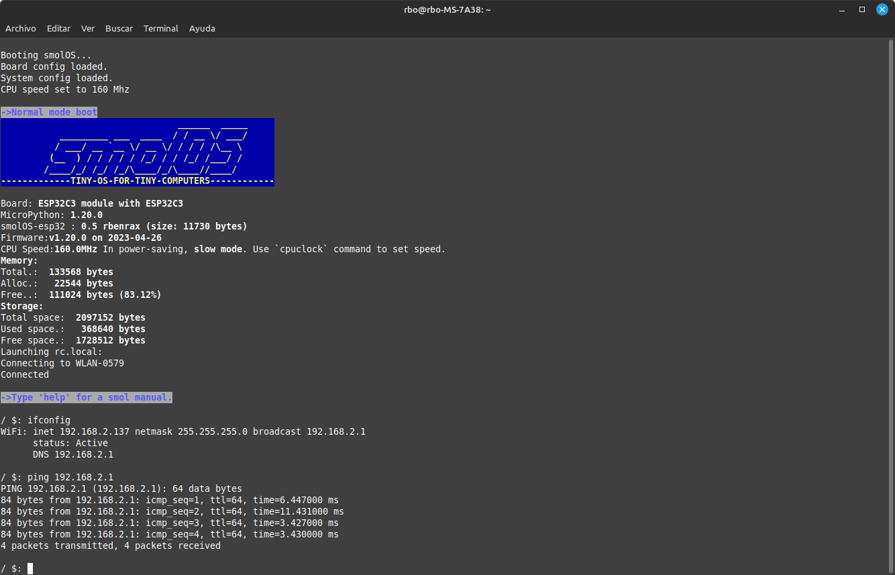

# smolOS-->upyOS

The project already has enough changes to propose a name change, the new name will be upyOS.

smolOS - a tiny and simple operating system for MicroPython (targetting ESP8266, RP2040, etc.) giving the user POSIX-like environment, originally developed by Krzysztof Krystian Jankowski and adapted by me.

[smolOS original github site](https://github.com/w84death/smolOS/tree/main)

[smolos docs site](http://smol.p1x.in/os/)

This is a simple test implementation with some modifications of smolOS over ESP32-C3, ESP8266 and YD-2040 and any others by rbenrax.
The target is to get a common base to use stand alone microcontroller, and fun using it. 

smolOS Help:

Adapted by rbenrax, source available in https://github.com/rbenrax/smolOS, based in Krzysztof Krystian Jankowski work available in smol.p1x.in/os/

Explanation:

The objective is to provide one more layer to micropython that allows us to manage a microcontroller in a similar way to what we use every day in a common computer, with the use of more simple programs that can be complemented in a more flexible way, obviously at the cost of lower performance and efficiency, but giving more facilities for those who start using microcontrollers.

In main.py we can launch grub or smolos directly (see files).

Grub will create in /etc dir a file (if doesn't exists) for configure the specific board pins, gpios and other parameters, you can remove unused parameter to optimize the memory use, also allow stop the system boot if any program hung the load.

In smolos boot, two shell scripts are executed, init.sh and rc.local, init.sh will launch system start up commands, and rc.local programa and commands specifics for a user solution, you can remove the commands you don't need and make the boot as fast as you want, as well as include commands or programs that you need.

Exists internal and external commands, and internal and externals shell scripts, internal located in /bin directory and are exceuted without extention, external can be located in any directory and are executed directly, external commands are self-explanatory and some have help (--h).

The system can be extended with more external commands and programs with the aim of keeping the memory footprint as low as possible, because the ram is quite small but the flash is big enough.

The sdata module contains all the system data, allowing access to the board configuration parameters, system configuration parameters, environment variables, etc., allowing access to these parameters between programs and scripts.

If system hungs in boot (ex. defective program), we can delete init.sh, then the system wil boot in recovery mode, also we can use recovery command in any time, which moves init.sh to init.rec and viceversa.

Since most microcontrollers only have one thread more, then one main thread and one alternative, python programs can be summited in a thread apart ending command with "&", asyncio programas may be used.

I hope it is useful for you!, there are things to do, and to improve.

Directories structure:
- boot.py         Micropython statup file
- main.py         Micropython statup file (boot system)

      /bin        Commands and shell scripts
      /etc        Configuration files
      /extlib     External libraries
      /lib        System implementations libraries
      /opt        Specific solution or add-on programs (not in path)
      /tmp        Temporary directory (to put what you don't know where to put :-)

Internals commands:

- help:   This help
- sh:     run external shell script if script has no sh extention
- py:     Run python code
- r:      Repeat last command
- ps:     Show (alternative) process status
- kill:   Kill (alternative) process
- exit:   Exit to Micropython shell

Actual external commands:

cat, cd, clear, cp, cpufreq, df, echo, env, export, fileup, find, free, grep, help, i2cscan, ifconfig, led, ls, lshw, lsmod, mi, mkdir, modules, mv, ping, pwd, reboot, recovery, rm, rmdir, rmmod, sh.sh, test, touch, uhttpd, unset, uptime, utelnetd, vi, wait, wget, wifi

esp32-c3

VCC-GND Studio YD-2040

NodeMCU

Actual Development:

- /lib/grubs.py the first process in boot, will create .board file in /etc directory if does not exists, this file shoud be edited to acomodate all the board resources available, if the .board file exists, smolos process will read its content and will enable the resources to be used by the system, modules, external commands, etc.

- /lib/smolos.py is the next load, is the OS core, has internal and external commands (/bin directory), all commands will be moved to external commands to reduce the memory use.

- Actual implementation also can call simple shell scripts, including /etc/init.sh and /etc/rc.local, the start up scripts.

- Added editor from https://github.com/octopusengine/micropython-shell/tree/master

- Reduced memory usage to fit on esp8266

- Added recovery mode, to avoid load of start up failed commands

- Added env envinment variables in scripts and python programs, export, echo, unset sdata.getenv() ans sdata.setenv().

- ls command is now full functional, or so I hope.

- Now shell scripts can translate environment variables.

- From command line prompt is possible input python code directly:

      ">" command allow input python code:
      / $: > import ftptiny
      / $: > ftp = ftptiny.FtpTiny()
      / $: > ftp.start()
      
      "<" command allow print any python expression:
      
      / $: < sys.modules
      {'smolos': <module 'smolos' from '/lib/smolos.py'>, 'flashbdev': <module 'flashbdev' from 'flashbdev.py'>, 'network': <module 'network'>, 'sdata': <module 'sdata' from '/lib/sdata.py'>, 'utls': <module 'utls' from '/lib/utls.py'>}
      
      / $: < 2+2
      4

- Simple support for thread management and asyncio, tests availables:
  
      / $: /opt/thr_test &            # thread test
      / $: /opt/asy_test &            # asyncio test in new thread
  

TODO List:
- Enhance ls, cp, mv, etc. commands
- Add diff, tar, uname, hostname and other usefull commands.
- Complete wifi and bluetooth support
- Enhance threads and asynio test
- Add pipes and output redirections??
- Fix errors

Wishlist is open ;)

