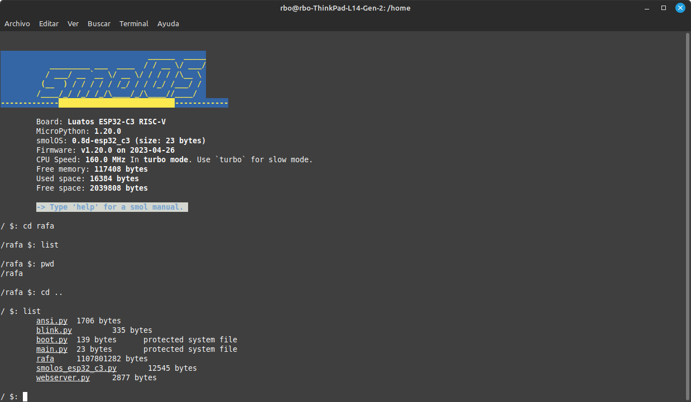

# smolOS

smolOS - a tiny and simple operating system for MicroPython (targetting ESP8266, RP2040, ESP32-C3, ETC.) giving the user POSIX-like environment to play by Krzysztof Krystian Jankowski.

[smolOS original site](https://github.com/w84death/smolOS/tree/main)

This is a simple test implementation of smolOS over ESP32-C3/YD-RP2040 by rbenrax.

Luatos esp32-c3

VCC-GND Studio YD-2040

TODO List:
- Editor to external .py
- Add regexp and directories to file managements
- Add Wifi client and AP
- Add grep, du, diff, find, tar, ping, ip, uname, hostname and wget.
- Add Digital pins, ADC pins, PWM pins, i2c pins and SPI pins to lshw

Wishlist is open ;)
