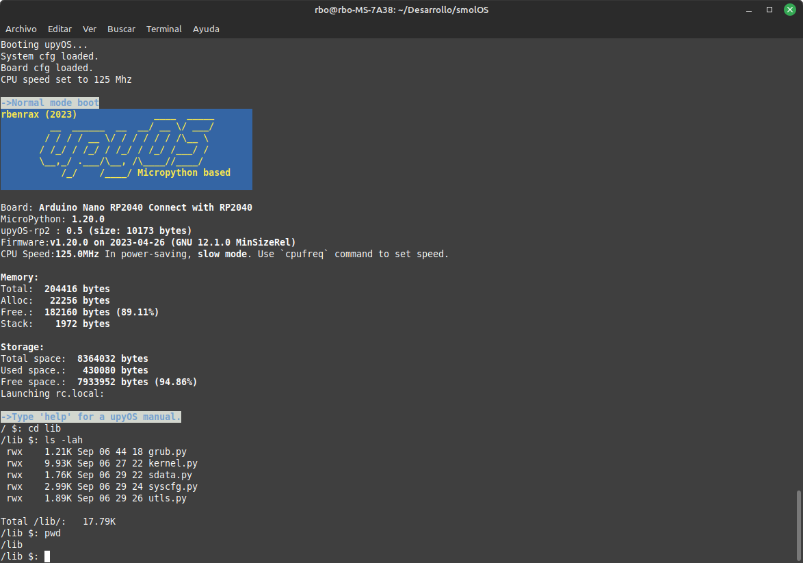
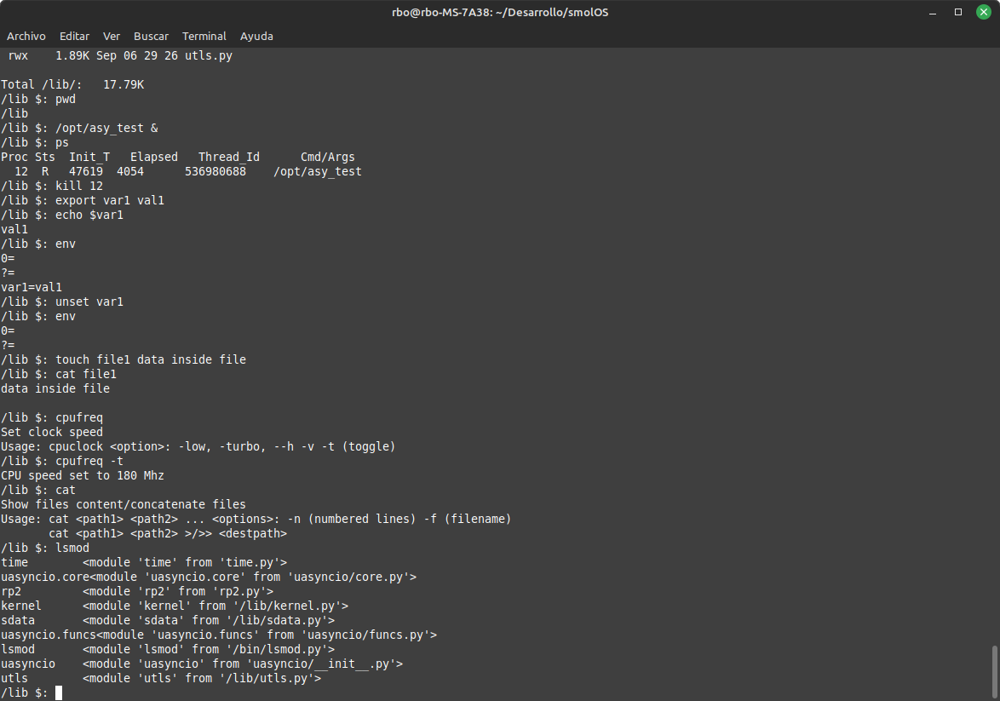
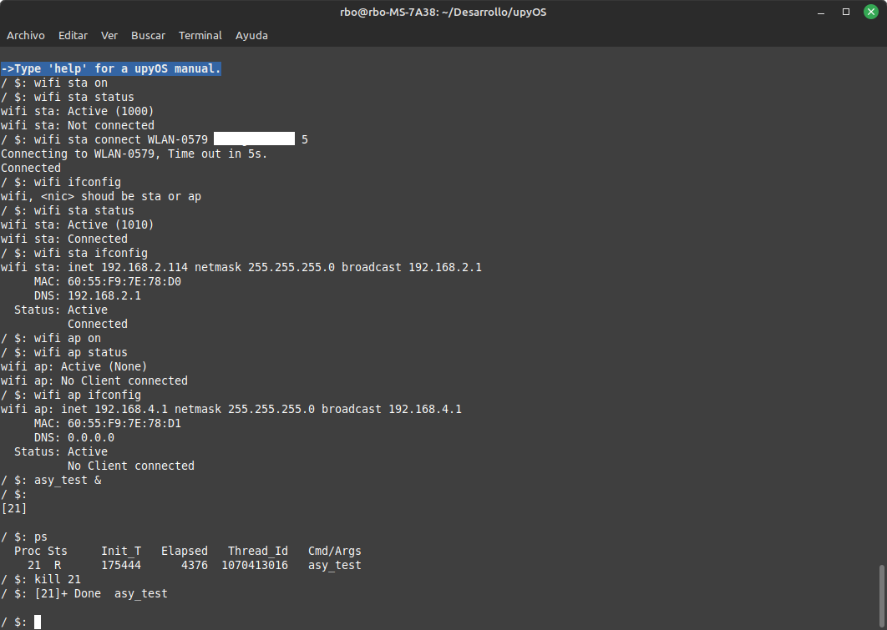
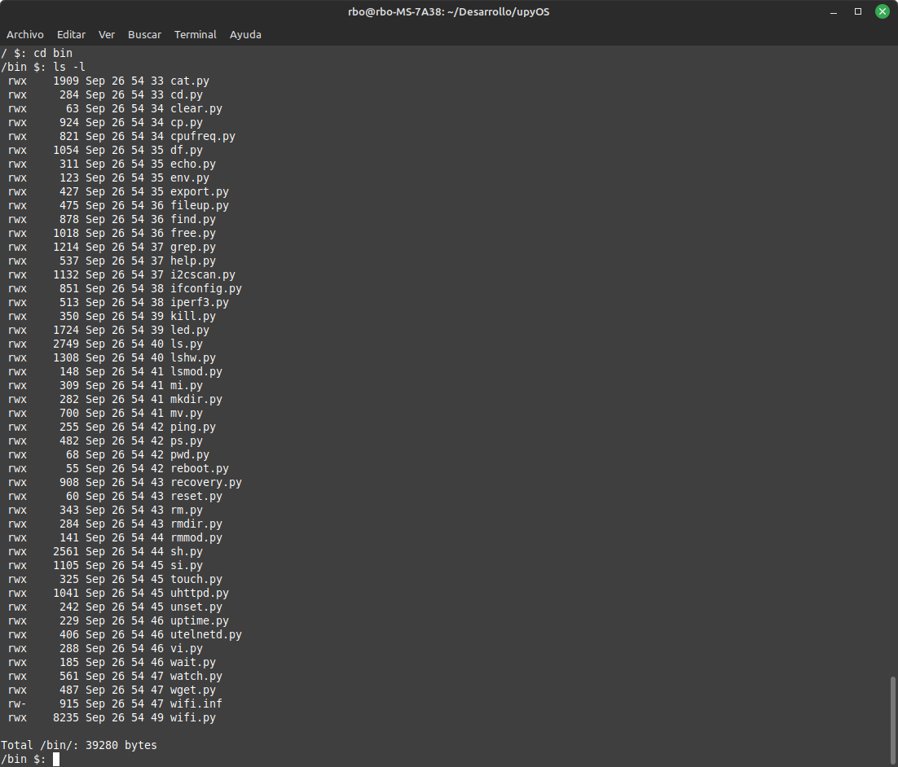
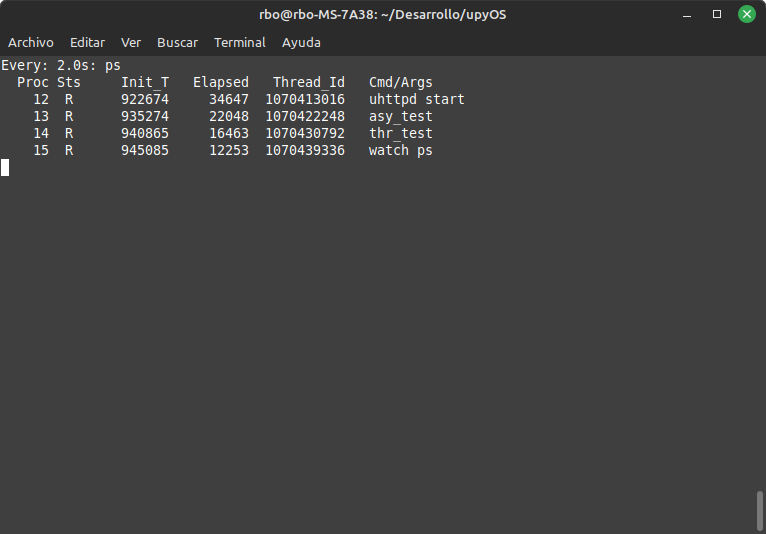
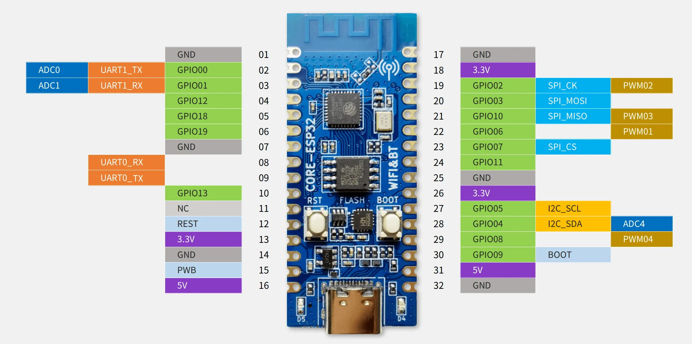
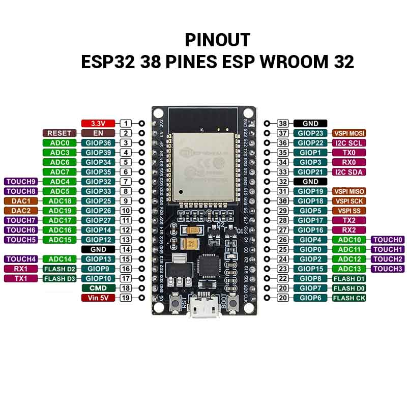
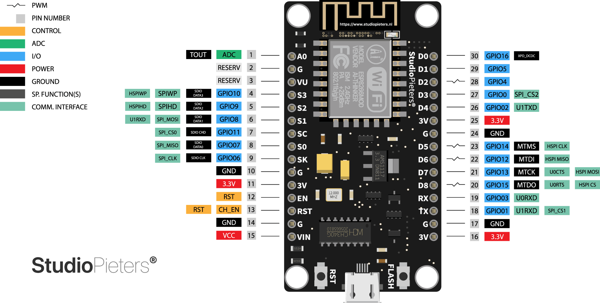
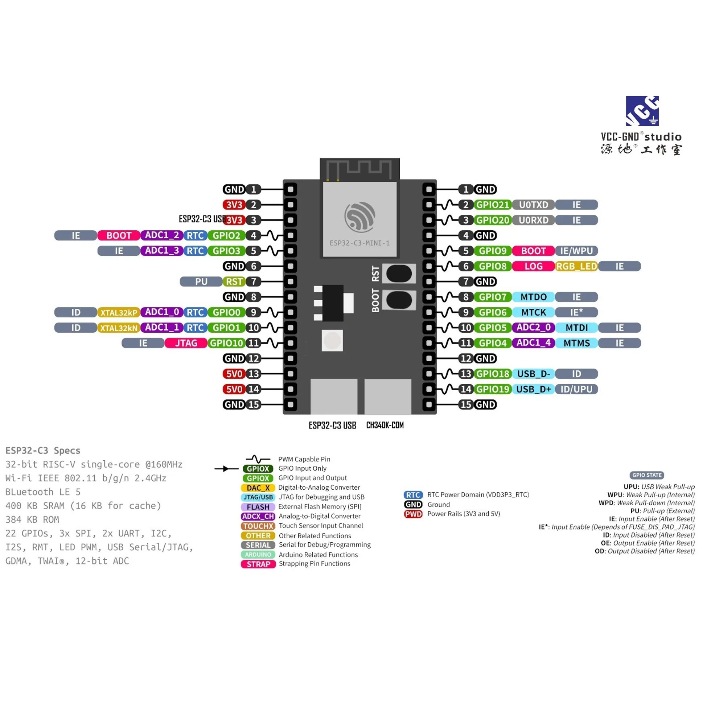

# upyOS

***MicroPython 1.26.0 Upgraded***

**upyOS** is a modular flash **Operating System** for microcontrollers based on **MicroPython**. It provides the user with a **POSIX-like environment**. The original idea is by **Krzysztof Krystian Jankowski** and has been adapted by me.

[smolOS Original GitHub Site](https://github.com/w84death/smolOS/tree/main)

The goal is to provide a common, modular base for using microcontrollers in a **standalone** manner, moving away from monolithic programs, promoting **module reuse**, and making it fun to use.

---

## upyOS Installation

```

```
git clone [https://github.com/rbenrax/upyOS.git](https://github.com/rbenrax/upyOS.git)

cd upyOS
mpremote fs -v cp main.py :main.py
mpremote fs -r -v cp bin etc lib libx opt tmp www :

mpremote
Ctrl+D
```

```

---

## Screenshots

### RP2040 Module Running upyOS




### ESP32-C3 Module Running upyOS





---

## upyOS Explanation

The aim of **upyOS** is to provide an additional layer to MicroPython, allowing us to manage a microcontroller similarly to how we use a common computer every day. This approach facilitates the use of simpler, more flexible programs that can complement each other. Naturally, this comes at the cost of lower performance and efficiency, but it offers greater ease of use and flexibility, especially for those new to microcontrollers.

### Boot and Exit

* On upyOS boot, **/etc/init.sh** launches system startup commands. You can remove unneeded commands to make the boot process as fast as you desire, as well as include programs or commands you need to run on startup.
* On upyOS exit, **/etc/end.sh** is launched to issue commands for disconnecting or closing processes.

### System Programs

The system can be extended with external commands and programs, aiming to keep the memory footprint as low as possible. RAM is quite small, but flash is usually big enough. Every program to be executed must define a `def __main__(args):` function.

### System Data

The **sdata** module contains all the system data, providing access to board configuration parameters, system configuration parameters, environment variables, and more, allowing these parameters to be accessed across programs and scripts.

### Recovery Mode

If the system hangs during boot (e.g., due to a defective program), you can boot into **recovery mode** by sending the commands `import utls` and `utls.recovery()` after connecting to the device.

### Multithreading

* The **RP2040** supports two threads and is limited to this number, but **ESP32** and other microcontrollers may have more.
* Python programs can be submitted in a separate thread by ending the command with the `&` symbol. **asyncio** programs may also be used.
* Threads can be stopped by `kill`/`killall` commands, but then must be controlled within the program's main loop. See examples in the `/opt` directory.

---

## Directory Structure

* `boot.py`: MicroPython startup file.
* `main.py`: MicroPython startup file (boots the system).

```

```
  /bin        Commands and shell scripts
  /etc        Configuration files
  /libx       External libraries
  /lib        System implementations libraries
  /opt        Specific solution or add-on programs (not in path)
  /tmp        Temporary directory (for files you don't know where else to put :-)
  /www        Web server directory
```

````

---

## Commands

### Internal Commands

* `exit`: Exits the current shell or script.
* `loadconfig`: Loads the system configuration file.
* `loadboard`: Loads the board interfaces configuration file.

### Actual External Commands

`cat`, `cd`, `clear`, `cp`, `cpufreq`, `date`, `decr`, `df`, `echo`, `env`, `export`, `fileup`, `find`, `free`, `grep`, `help`, `hold`, `i2cscan`, `ifconfig`, `incr`, `iperf3`, `kill`, `killall`, `led`, `ls`, `lshw`, `lsmod`, `mi`, `mkdir`, `mv`, `ntpupdate`, `ping`, `ps`, `pwd`, `read`, `reboot`, `reset`, `resume`, `rm`, `rmdir`, `rmmod`, `sensors`, `sh`, `si`, `sleep`, `test`, `touch`, `uftpd`, `uhttpd`, `unset`, `uptime`, `utelnetd`, `vi`, `wait`, `watch`, `wget`, `wifi.inf`, `wifi`

---

## Tested Boards

* **ESP32-C3**
    
* **VCC-GND Studio YD-2040**
    
* **GOOUUU ESP32 WROOM-32**
    
* **NodeMCU**
    
* **YD-ESP32-C3**
    
* **YD-ESP32-S3 with 8Mb PSRAM**
    

---

## Current Development

* **/lib/kernel.py** is the first module loaded; it's the OS core of the system. The first time it runs, it creates the `.board` file in the `/etc` directory if it doesn't exist. External commands are located in the `/bin` directory.
* The current implementation can also call simple shell scripts, including **/etc/init.sh** and **/etc/end.sh** (the startup and system shutdown scripts).
* Added editor from [octopusengine/micropython-shell](https://github.com/octopusengine/micropython-shell/tree/master).
* Reduced memory usage to fit on **ESP8266**.
* Added **recovery mode** to prevent the loading of failed startup commands or programs.
* Added support for **environment variables** in scripts and Python programs: `export`, `echo`, `unset`, `utls.getenv(var)`, and `utls.setenv(var, val)`.
* The **ls** command is now fully functional, or so I hope 😉.
* Commands now translate environment variables.
* From the command line prompt and shell scripts, it's possible to input Python code directly:
    * The `>` command allows inputting Python code:
        ```
        / $: > import ftptiny
        / $: > ftp = ftptiny.FtpTiny()
        / $: > ftp.start()
        ```
    * The `<` command allows printing any Python expression:
        ```
        / $: < sys.modules
        {'kernel': <module 'kernel' from '/lib/kernel.py'>, 'flashbdev': <module 'flashbdev' from 'flashbdev.py'>, 'network': <module 'network'>, 'sdata': <module 'sdata' from '/lib/sdata.py'>, 'utls': <module 'utls' from '/lib/utls.py'>}

        / $: < 2+2
        4
        
        / $: > import esp32
        / $: < esp32.mcu_temperature()
        31
        ```
* Management support for **multiple threads and asyncio** (tests available: `&`, `ps`, `kill`, `killall`, `wait`, `hold`, and `resume`):
    ```
      / $: /opt/thr_test &            # thread test
      / $: /opt/asy_test &            # asyncio test in new thread
    ```

### Basic upyOS Program Structure

```python
import xxxx

proc=None			# Reference to the current process

def __main__(args):		# Entry point and command line arguments

   # Your code ...
    
   while True:			# Main loop (for, while, etc)
   
        if proc.sts=="S":break	# Mechanism to stop the process if it is launched in batch (&)
        
        if proc.sts=="H":	# Mechanism to hold and resume the process if it is launched in batch (&) and held
            utime.sleep(1)
            continue
        
        # Your code ...
        
   # Your code ...
````

### Shell Scripting

Basic **conditional execution** in shell scripts is supported, as well as **labels** and the **goto** instruction.

  * **`example.sh`**:

    ```bash
    export var1 5   # Set variable var1 to "5" (variables can also be accessed from Python programs and embedded Python)
    if $var1 != 5 skip 3 # Skip 3 lines if comparison is true (will continue in 4, 5, etc)
    < 1
    < 2
    < skip 2
    < 4
    < 5
    if $var1 == 3 return        # Ends shell script
    if $var1 == 5 run watch ps -t 5 # Launch command "watch ps" every 5 seconds
    if $var1 == 6 run asy_test &    # Submit asy_test process
    ```

  * **`menu.sh`**, an example of loop usage:

    ```bash
    :loop
    clear
    < "Options Menu"
    < ""
    < "Option 1 160MHz"
    < "Option 2 240Mhz"
    < "Option 3 return"
    < "Option 0 exit"
    < ""
    echo "Last option: " $v1
    read v1 "Enter option: "
    if $v1 == 1 cpufreq 160
    if $v1 == 2 cpufreq 240
    if $v1 == 3 return
    if $v1 != 0 goto loop
    exit
    ```

  * **`wifi startup sh script`** example (can be called from `init.sh`):

    ```bash
    #
    # WiFi connection and services startup
    #

    wifi sta on                      # Turn on wifi in client mode

    wifi sta status 

    #wifi sta scan                   # scan wifi APs

    wifi sta connect <SSID> <password> 10 # SSID PASS Timeout

    wifi sta status -n
    if $wa == False goto exit # wifi active
    if $wc == False goto exit # wifi connected

    ntpupdate es.pool.ntp.org

    date

    wifi sta ifconfig

    utelnetd start
    uftpd start
    uhttpd start &

    :exit
    ```

  * Script triggered on system exit to stop running services:

    ```bash
    test -p uhttpd > 0
    if $0 == True uhttpd stop
    unset 0

    uftpd stop
    utelnetd stop

    wifi sta status -n
    if $wc == True wifi sta disconnect -n
    if $wa == True wifi sta off
    ```

  * Script execution on boot:

  * Loops in shell scripts:

    ```bash
    :cont
    incr a
    if $a <= 5 goto cont
    echo $a

    :cont2
    decr a
    if $a > 4 goto cont2
    echo $a
    ```

  * `init.sh` example with SSD1306 Oled display and process start:

    ```bash
    # Init shell script 
    loadboard /etc/upyOS-esp32c3_vcc_gnd.board

    #ESP32-C3  ->  Display SSD1306
    #-----------------------------
    #GND       ->  GND
    #3.3V      ->  VCC
    #GPIO6     ->  SCK  D0
    #GPIO7     ->  MOSI D1
    #GPIO2     ->  MISO (unused)
    #GPIO11    ->  RES (Reset)
    #GPIO3     ->  DC (Data/Command)
    #GPIO10    ->  CS (Chip Select)

    # Display0 driver load
    > from machine import Pin, SPI
    > import ssd1306
    > sdata.d0 = ssd1306.SSD1306_SPI(128, 64, SPI(1), Pin(3), Pin(11), Pin(10)) # GPIOs assignment
    > d0 = sdata.d0 	# Global reference for use in other programs

    > d0.fill(0)
    > d0.text(sdata.name + " " + sdata.version, 0, 0, 1)
    > d0.line(0, 15, 127, 15, 1)
    > d0.text("Iniciando...", 0, 16, 1)
    > d0.show()

    # Wifi sta
    wifi sta on                      	# Turn on wifi in client mode

    #wifi sta status
    #wifi sta scan                   	# scan wifi APs

    # Crear variable de entorno
    export essid <essid>
    export passw <password>

    > d0.text("Try.. " + utls.getenv("essid"), 0, 26, 1)  # Get environment variable to show on display
    > d0.show()

    wifi sta connect $essid $passw 10 	# Connect to wifi router

    wifi sta status -n
    if $wa == False goto exit 		# wifi active
    if $wc == False goto exit 		# wifi connected

    > d0.text("Connected", 0, 36, 1)
    > d0.show()

    ntpupdate es.pool.ntp.org		# Time sync
    date

    > d0.text("ntpupdate", 0, 46, 1)
    > d0.text("Ready", 0, 56, 1)
    > d0.show()

    wifi sta ifconfig

    utelnetd start				# Start telnet server
    uftpd start				# Start ftp server
    uhttpd start &				# Start web server

    #/local/dsp.py &			# Start utility program as a thread

    :exit
    unset essid				# Remove environment variables
    unset passw
    ```

-----

## upyOS Remote Development 🛠️

  * Start the telnet service (`utelnet start`) on the remote MCU.
  * Start the ftp server service (`uftpd start`) on the remote MCU.
  * Install the **`ftpfs`** package (available in my repositories) on your local machine instead of `curlftpfs` (which is considered unmaintained and removed from Linux distributions).
  * On your local machine, mount the remote directory using **`ftpfs`** instructions, e.g., `ftpfs user@<mcu_ip> <local path>`.
  * You can develop in the mounted `<local path>` directory using **Thonny** or your favorite IDE.
  * Access the MCU console via its IP address using a telnet client to run commands and programs.

### Authentication

Added user and password authentication for accessing the telnet and ftp servers. The user and password are stored in the `/etc/system.conf` file. If no password is set, authentication is disabled.

### Android Development

By starting `utelnet` and `uftpd` on boot, you can develop remotely from **Android** using apps like **"Serial wifi terminal"** and **"Squircle CE"** from Google Play. **Termux** is also an excellent option as a telnet client.

-----

## Upgrade Command (OTA)

Added the **`upgrade`** command for **Over-The-Air (OTA)** upgrade from the GitHub repository.

```
	/ $: upgrade
	upyOS OTA Upgrade,
	Downloading upgrade list..., OK
	Confirm upyOS upgrade (y/N)? y
	Upgrading from upyOS github repository, wait...
	[.......................................................................................]OK
	100% Upgrade complete
	/ $:
	
	Note: On systems with low memory (e.g., ESP32-C3), the MCU must boot only with the Telnet service, without any other services, due to the memory requirements of the encryption system for performing the update.
```

-----

## File System Cache

Added call caching to the File System (FS). On systems with low memory, this should be disabled in `sdata.py`. On systems with more memory (e.g., ESP32S3 with 8MB of PSRAM), enabling it speeds up file system access.

-----

## Remote Development Environment Example

Screenshot of developing on an ESP32 MCU with upyOS +  and telnet in Geany, VS Code, or other IDEs, both locally and remotely:

### ftpfs Remote Development Environment, Linux Installation

```bash
	# ftpfs used to access mcu filesystem:
	
	# Install Linux dependencies:
	sudo apt-get install fuse libfuse-dev python3-pip
	pip3 install fusepy

	# Create a local directory and mount:
	mkdir ~/dev_upyos
	python3 ftpfs.py <mcu_IP> ~/dev_upyos -u admin -P <password> 
    # Default user is admin and no password. Use 'setauth' upyOS command to set a password.

	# Check directory use:
	ls ~/dev_upyos
	
	# Open favorite IDE:
	# VS Code, Geany, Gedit, etc.
	# Open mounted directory (~/dev_upyos) and use telnet from the IDE terminal to connect to the MCU.

	# To unmount:
	fusermount -u ~/dev_upyos
```

  * **Android Alternative:** Squircle CE + Termux Apps

-----

## TODO List

  * Add other useful commands.
  * Add Syslog.

The Wishlist is open\! 😉

```
```
