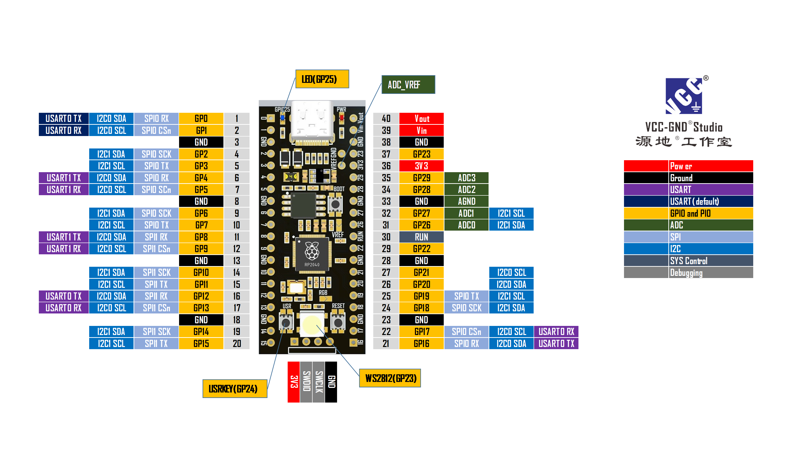

# upyOS

upyOS is a modular flash Operating System for microcontrollers based on Micropython, giving the user POSIX-like environment, original idea by Krzysztof Krystian Jankowski and adapted by me.

[smolOS original github site](https://github.com/w84death/smolOS/tree/main)

The target is to get a common modular base to use stand alone microcontroller, avoiding monolithics programs, reuse modules and fun using it. 

Secreenshots of rp2040 module running upyOS:

Secreenshots of esp32c3 module running upyOS:

upyOS explanation:

The target is to provide one more layer to micropython that allows us to manage a microcontroller in a similar way to what we use every day in a common computer, with the use of more simple programs that can be complemented in a more flexible way, obviously at cost of lower performance and efficiency, but giving more facilities and flexibility for those who start using microcontrollers.

On upyOS boot, /etc/init.sh will launch system start up commands, you can remove commands you don't need and make the boot as fast as you want, as well as, include commands or programs that you need run on statup.

The system can be extended with external commands and programs with the aim of keeping the memory footprint as low as possible, because the ram is quite small but the flash is big enough, every program to be executed must define a "def __main__(args):" function.

The sdata module contains all the system data, allowing access to the board configuration parameters, system configuration parameters, environment variables, etc., allowing access to these parameters between programs and scripts.

If system hungs in boot (ex. defective program), we can boot in recovery mode by sending "import utls" and "utls.recovery()" commands.

RP2040 has only two threads and is limited to this number, but ESP32 and others may have more. Python programs can be submitted in a separate thread by ending the command with '&' symbol, and asyncio programs may also be used."

Threads may be stopped by kill/killall commands, but then must be controlled in main loop inside the program, see examples in /opt directory.

I hope it is useful for you!, there are things to do, and to improve.

Directories structure:
- boot.py         Micropython statup file
- main.py         Micropython statup file (boot system)

      /bin        Commands and shell scripts
      /etc        Configuration files
      /libx       External libraries
      /lib        System implementations libraries
      /opt        Specific solution or add-on programs (not in path)
      /tmp        Temporary directory (to put what you don't know where to put :-)

Internals commands:

- exit
- loadconfig: Load system config file
- loadboard:  Load board interfaces configuration file

Actual external commands:

cat, cd, clear, cp, cpufreq, date, decr, df, echo, env, export, fileup, find, free, grep, help, hold, i2cscan, ifconfig, incr, iperf3, kill, killall, led, ls, lshw, lsmod, mi, mkdir, mv, ntpupdate, ping, ps, pwd, read, reboot, reset, resume, rm, rmdir, rmmod, sensors, sh, si, sleep, test, touch, uftpd, uhttpd, unset, uptime, utelnetd, vi, wait, watch, wget, wifi.inf, wifi

Tested Boards:

esp32-c3

VCC-GND Studio YD-2040

GOOUUU ESP32 WROOM-32

NodeMCU

YD-ESP32-C3

YD-ESP32-S3 with 8Mb PSRAM

Actual Development:

- /lib/grubs.py the first process in boot, will create .board file in /etc directory if does not exists, this file shoud be edited to acomodate all the board resources available, if the .board file exists, upyOS process will read its content and will enable the resources to be used by the system, modules, external commands, etc.

- /lib/kernel.py upyos class is the next load, is the OS core, has internal and external commands (/bin directory), all commands will be moved to external commands to reduce the memory use.

- Actual implementation also can call simple shell scripts, including /etc/init.sh and /etc/rc.local, the start up scripts.

- Added editor from https://github.com/octopusengine/micropython-shell/tree/master

- Reduced memory usage to fit on esp8266

- Added recovery mode, to avoid load of start up failed commands

- Added environment variables in scripts and python programs, export, echo, unset sdata.getenv() ans sdata.setenv().

- ls command is now full functional, or so I hope.

- Now commands translate environment variables.

- From command line prompt and shell scripts is possible input python code directly:

      ">" command allow input python code:
      / $: > import ftptiny
      / $: > ftp = ftptiny.FtpTiny()
      / $: > ftp.start()
      
      "<" command allow print any python expression:
      
      / $: < sys.modules
      {'kernel': <module 'kernel' from '/lib/kernel.py'>, 'flashbdev': <module 'flashbdev' from 'flashbdev.py'>, 'network': <module 'network'>, 'sdata': <module 'sdata' from '/lib/sdata.py'>, 'utls': <module 'utls' from '/lib/utls.py'>}
      
      / $: < 2+2
      4

- Management support for multiples threads and asyncio, tests availables (&, kill, killall, wait):
  
      / $: /opt/thr_test &            # thread test
      / $: /opt/asy_test &            # asyncio test in new thread
  
- Shell script basic conditional execution:

example.sh

      export var1 5   # Set variable var1 to "5" (variables can also be accesed from Python programs and embedded Python)
      if $var1 != 5 skip 3 # Skip 3 lines if comparison is true (will continue in 4, 5, etc)
      < 1
      < 2
      < skip 2
      < 4
      < 5
      if $var1 == 3 return        # Ends shell script
      if $var1 == 5 run watch ps -t 5 # Launch command "watch ps" every 5 seconds
      if $var1 == 6 run asy_test &    # Summit asy_test process

  menu.sh
  
      :loop
      clear
      < "Options Menu"
      < ""
      < "Option 1 160MHz"
      < "Option 2 240Mhz"
      < "Option 3 return"
      < "Option 0 exit"
      < ""
      echo "Last option: " $v1
      read v1 "Enter option: "
      if $v1 == 1 cpufreq 160
      if $v1 == 2 cpufreq 240
      if $v1 == 3 return
      if $v1 != 0 goto loop
      exit

services startup sh script

      #
      # WiFi connnection and and services startup
      # 
      
      loadboard /etc/upyOS-esp32c3_luatos.board
      
      wifi sta on
      
      #wifi sta scan
      
      wifi sta connect DIGIFIBRA-cGPRi <password> 10
      
      wifi sta status             # status subcommand save in env var if active and connected status
      if $0 == 0 goto exit        # If not active
      if $1 == 0 goto exit        # If not connected
      
      ntpupdate es.pool.ntp.org
      date
      wifi sta ifconfig
      unset 0 1
      
      utelnetd start
      uftpd start
      
      #> import micropython
      #> micropython.kbd_intr(-1)
      
      :exit
      echo end
      #wifi sta disconnect
      #wifi sta off
      #exit

Script execution in boot:

loops in shell scripts!:

      :cont
      incr a
      if $a <= 5 goto cont
      echo $a

      :cont2
      decr a
      if $a > 4 goto cont2
      echo $a

upyOS remote development:
- Start in remote mcu telnet service (utelnet start)
- Start in remote mcu ftpserver service (uftpd start)
- Install in local machine curlftpfs package
- In local machine mount remote directory with "curlftpfs user@<mcuip> <local path>"
- With Tonny you can develop in <local path>
- Access with telnet to the mcu console ip to run commands and programs

TODO List:
- Add diff, tar, uname, read and other usefull commands.
- Bluetooth support
- Add Syslog
- Upgrade procedure
- jobq?

Wishlist is open ;)

