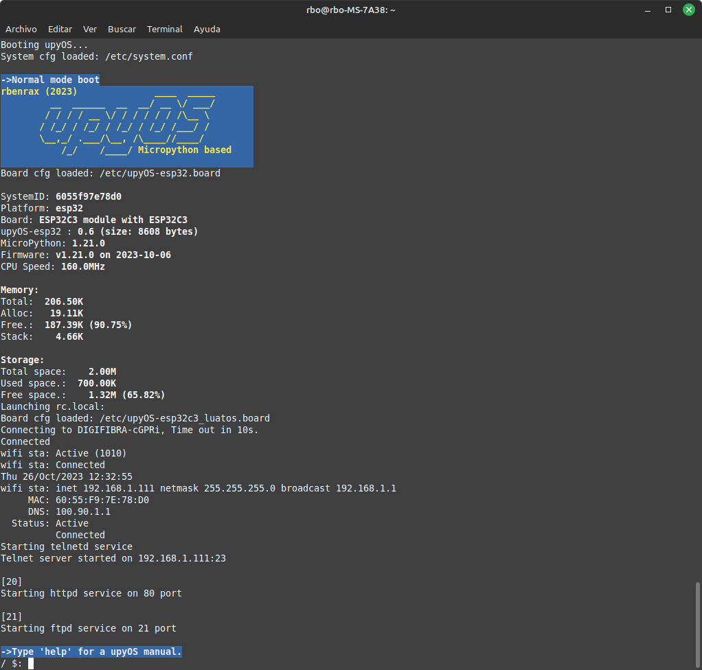
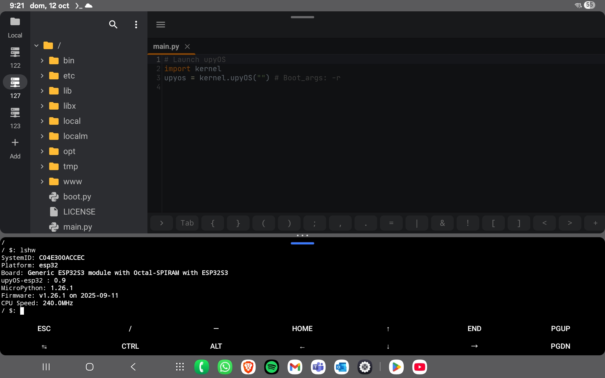

# upyOS

***MicroPython 1.26.1 Upgraded***

**upyOS** is a modular flash **Operating System** for microcontrollers based on **MicroPython**. It provides the user with a **POSIX-like environment**. The original idea is by Krzysztof Krystian Jankowski and has been adapted by me.

[smolOS Original GitHub Site](https://github.com/w84death/smolOS/tree/main)

The goal is to provide a common, modular base for using microcontrollers in a **standalone** manner, moving away from monolithic programs, promoting **module reuse**, and making it fun to use.

---

## 🌟 Key Features at a Glance

### 🎯 Design Philosophy
- **Modular architecture** promoting code reuse and flexibility
- **Alternative to monolithic programs** for easier maintenance
- **Standalone microcontroller operation** without external dependencies
- **POSIX-like environment** for familiar Unix/Linux-style interaction

### 📁 Unix-like System Structure
- Hierarchical directory structure: `/bin`, `/etc`, `/lib`, `/libx`, `/opt`, `/tmp`, `/www`
- Startup (`/etc/init.sh`) and shutdown (`/etc/end.sh`) scripts
- **60+ built-in commands** (ls, cd, cp, mv, grep, ps, kill, wifi, gpio, etc.)
- Board-specific configuration files (`.board`)

### ⚙️ Process Management
- **Multi-threading support** with background execution (`&`)
- **Asyncio support** for asynchronous programming
- Process control: `ps`, `kill`, `killall`, `hold`, `resume`, `wait`
- Thread management with status control in program loops

### 🔧 Shell and Scripting
- **Conditional execution** with `if` statements
- **Loop support** with labels and `goto` instructions
- **Output redirection** to files (`>`, `>>`) or environment variables
- **Environment variables** with `export`, `echo`, `unset`
- **Direct Python code execution** from shell (`>` for code, `<` for expressions)

### 🌐 Network Connectivity
- **Complete WiFi management** (scan, connect, status, disconnect)
- **Built-in servers:** Telnet (`utelnetd`), FTP (`uftpd`), HTTP (`uhttpd`)
- **NTP time synchronization** (`ntpupdate`)
- **OTA updates** from GitHub repository (`upgrade` command)
- **User authentication** for network services
- **ESP-AT UART modem support** for MCUs without integrated WiFi (RP2040, etc.)

### 💾 Advanced Features
- **File system call caching** (configurable based on available memory)
- **Recovery mode** for boot failures
- **Remote development** via FTP + Telnet (compatible with VS Code, Geany, Thonny)
- **Android development support** (Serial WiFi Terminal, Squircle CE, Termux)
- **System data module** (`sdata`) for shared configuration and parameters

### 🖥️ Hardware Support
- **ESP32** family (ESP32, ESP32-C3, ESP32-S3)
- **RP2040** boards
- **ESP8266** (optimized for low memory)
- **NodeMCU** and various development boards

### 🚀 Performance Characteristics
upyOS prioritizes **flexibility and ease of use** over raw performance, making it ideal for:
- Developers new to microcontrollers
- Projects requiring modular, maintainable code
- Rapid prototyping and experimentation
- Educational and learning purposes
- IoT applications and home automation

---

## 📋 Table of Contents
- [Installation](#-upyos-installation)
- [Screenshots](#-screenshots)
- [Explanation](#-upyos-explanation)
- [Directory Structure](#-directory-structure)
- [Commands](#-commands)
- [Shell Scripting](#-shell-scripting)
- [Remote Development](#%EF%B8%8F-upyos-remote-development)
- [OTA Upgrade](#-upgrade-command-ota)
- [ESP-AT Modem Support](#-esp-at-modem-support)
- [Tested Boards](#-tested-boards)
- [TODO List](#-todo-list)

---

## 🚀 upyOS Installation

### Prerequisites

- The target microcontroller board must have the MicroPython package already loaded *before* starting the "mpremote" procedure outlined below. [How to install MicroPython on an ESP32-C3 board](https://micropython.org/download/ESP32_GENERIC_C3/)

- You may also need to install the `esptool` package in order to load the micropython package from your host computer to the target microcontroller.
- Your host computer needs the `micropython-mpremote` package installed in order to communicate with the target microcontroller.

Now you can continue with the installation of upyOS:

```bash
git clone https://github.com/rbenrax/upyOS.git

cd upyOS
mpremote fs -v cp main.py :main.py
mpremote fs -r -v cp bin etc lib libx opt tmp www :

mpremote
Ctrl+D
```

---

## 📸 Screenshots

### RP2040 Module Running upyOS


### ESP32-C3 Module Running upyOS


---

## 💡 upyOS Explanation

The aim of **upyOS** is to provide an additional layer to MicroPython, allowing us to manage a microcontroller similarly to how we use a common computer every day. This approach facilitates the use of simpler, more flexible programs that can complement each other. Naturally, this comes at the cost of lower performance and efficiency, but it offers greater ease of use and flexibility, especially for those new to microcontrollers.

### Boot and Exit

* On upyOS boot, **/etc/init.sh** launches system startup commands. You can remove unneeded commands to make the boot process as fast as you desire, as well as include programs or commands you need to run on startup.
* On upyOS exit, **/etc/end.sh** is launched to issue commands for disconnecting or closing processes.

### System Programs

The system can be extended with external commands and programs, aiming to keep the memory footprint as low as possible. RAM is quite small, but flash is usually big enough. Every program to be executed must define a `def __main__(args):` function.

### Basic upyOS Program Structure

```python
import xxxx

proc=None               # Reference to the current process

def __main__(args):     # Entry point and command line arguments

   # Your code ...
    
   while True:          # Main loop (for, while, etc)
   
        if proc.sts=="S":break  # Mechanism to stop the process if it is launched in batch (&)
        
        if proc.sts=="H":       # Mechanism to hold and resume the process if it is launched in batch (&) and held
            utime.sleep(1)
            continue
        
        # Your code ...
        
   # Your code ...
```

### System Data

The **sdata** module contains all the system data, providing access to board configuration parameters, system configuration parameters, environment variables, and more, allowing these parameters to be accessed across programs and scripts.

### Recovery Mode

If the system hangs during boot (e.g., due to a defective program), you can boot into **recovery mode** by sending the commands `import utls` and `utls.recovery()` after connecting to the device.

### Multithreading

* The **RP2040** supports two threads and is limited to this number, but **ESP32** and other microcontrollers may have more.
* Python programs can be submitted in a separate thread by ending the command with the `&` symbol. **asyncio** programs may also be used.
* Threads can be stopped by `kill`/`killall` commands, but then must be controlled within the program's main loop. See examples in the `/opt` directory.

---

## 📁 Directory Structure

* `boot.py`: MicroPython startup file.
* `main.py`: MicroPython startup file (boots the system).
* `/bin` - Commands and shell scripts
* `/etc` - Configuration files
* `/libx` - External libraries
* `/lib` - System implementations libraries
* `/opt` - Specific solution or add-on programs (not in path)
* `/tmp` - Temporary directory (for files you don't know where else to put :-)
* `/www` - Web server directory

---

## ⌨️ Commands

### Internal Commands

* `exit`: Stop upyOS and all running processes.
* `killall`: Stops all running processes
* `loadconfig`: Loads the system configuration file.
* `loadboard`: Loads the board interfaces configuration file.

### External Commands (60+)

`cat`, `cd`, `clear`, `cp`, `cpufreq`, `date`, `decr`, `df`, `echo`, `env`, `export`, `fileup`, `find`, `free`, `gpio`, `grep`, `help`, `hold`, `i2cscan`, `ifconfig`, `incr`, `iperf3`, `kill`, `killall`, `led`, `ls`, `lshw`, `lsmod`, `mi`, `mkdir`, `mv`, `ntpupdate`, `ping`, `ps`, `pwd`, `read`, `reboot`, `release`, `reset`, `resume`, `rm`, `rmdir`, `rmmod`, `sensors`, `setauth`, `sh`, `si`, `sleep`, `test`, `touch`, `uftpd`, `uhttpd`, `unset`, `upgrade`, `uptime`, `utelnetd`, `vi`, `wait`, `watch`, `wget`, `wifi`

### Command Output Redirection

Some commands allow you to redirect output (`>`, `>>`):
- If the variable name contains `/` or `.` characters, the output will be to a **file**
- If it doesn't contain any of those characters, the output will be redirected to an **environment variable**
- If you want to send the output to a file without extension, you must indicate the complete path

Environment variables can have any specific type since they are also used with interprocess communication.

### Board Definition Files

Each board must have a `.board` file, which defines its specifications and capabilities, also defines the assignment of GPIOs to the pins and the GPIOs of the different buses and resources. It must be loaded in the script `/etc/init.sh` and can be consulted with the command `lshw -f`. In programming you can use different functions to access the resources, for example: `utls.getgpio(5)` and `utls.getgpios("i2c",0)`

---

## 🔧 Current Development Features

* **/lib/kernel.py** is the first module loaded; it's the OS core of the system. The first time it runs, it creates the `.board` file in the `/etc` directory if it doesn't exist. External commands are located in the `/bin` directory.
* The current implementation can also call simple shell scripts, including **/etc/init.sh** and **/etc/end.sh** (the startup and system shutdown scripts).
* Added editor from [octopusengine/micropython-shell](https://github.com/octopusengine/micropython-shell/tree/master).
* Reduced memory usage to fit on **ESP8266**.
* Added **recovery mode** to prevent the loading of failed startup commands or programs.
* Added support for **environment variables** in scripts and Python programs: `export`, `echo`, `unset`, `utls.getenv(var)`, and `utls.setenv(var, val)`.
* The **ls** command is now fully functional, or so I hope 😉.
* Commands now translate environment variables.

### Direct Python Code Execution

From the command line prompt and shell scripts, it's possible to input Python code directly:

* The `>` command allows inputting Python code:
```bash
/ $: > import ftptiny
/ $: > ftp = ftptiny.FtpTiny()
/ $: > ftp.start()
```

* The `<` command allows printing any Python expression:
```bash
/ $: < sys.modules
{'kernel': <module 'kernel' from '/lib/kernel.py'>, 'flashbdev': <module 'flashbdev' from 'flashbdev.py'>, 'network': <module 'network'>, 'sdata': <module 'sdata' from '/lib/sdata.py'>, 'utls': <module 'utls' from '/lib/utls.py'>}

/ $: < 2+2
4

/ $: > import esp32
/ $: < esp32.mcu_temperature()
31
```

### Multiple Threads and Asyncio

Management support for **multiple threads and asyncio** (tests available: `&`, `ps`, `kill`, `killall`, `wait`, `hold`, and `resume`):
```bash
/ $: /opt/thr_test &            # thread test
/ $: /opt/asy_test &            # asyncio test in new thread
```

---

## 📜 Shell Scripting

Basic **conditional execution** in shell scripts is supported, as well as **labels** and the **goto** instruction.

### Example Scripts

#### Basic Conditional Execution (`example.sh`)

```bash
export var1 5   # Set variable var1 to "5" (variables can also be accessed from Python programs and embedded Python)
if $var1 != 5 skip 3 # Skip 3 lines if comparison is true (will continue in 4, 5, etc)
< 1
< 2
< skip 2
< 4
< 5
if $var1 == 3 return        # Ends shell script
if $var1 == 5 run watch ps -t 5 # Launch command "watch ps" every 5 seconds
if $var1 == 6 run asy_test &    # Submit asy_test process
```

#### Menu Loop Example (`menu.sh`)

```bash
:loop
clear
< "Options Menu"
< ""
< "Option 1 160MHz"
< "Option 2 240Mhz"
< "Option 3 return"
< "Option 0 exit"
< ""
echo "Last option: " $v1
read v1 "Enter option: "
if $v1 == 1 cpufreq 160
if $v1 == 2 cpufreq 240
if $v1 == 3 return
if $v1 != 0 goto loop
exit
```

#### WiFi Startup Script

Example (can be called from `init.sh`):

```bash
#
# WiFi connection and services startup
#

wifi sta on                      # Turn on wifi in client mode

wifi sta status 

#wifi sta scan                   # scan wifi APs

wifi sta connect <SSID> <password> 10 # SSID PASS Timeout

wifi sta status -n
if $wa == False goto exit # wifi active
if $wc == False goto exit # wifi connected

ntpupdate es.pool.ntp.org

date

wifi sta ifconfig

utelnetd start
uftpd start
uhttpd start &

:exit
```

#### System Exit Script

Script triggered on system exit to stop running services:

```bash
test -p uhttpd > 0
if $0 == True uhttpd stop
unset 0

uftpd stop
utelnetd stop

wifi sta status -n
if $wc == True wifi sta disconnect -n
if $wa == True wifi sta off
```

#### Script Execution on Boot



#### Loop Examples

```bash
:cont
incr a
if $a <= 5 goto cont
echo $a

:cont2
decr a
if $a > 4 goto cont2
echo $a
```

#### Advanced init.sh with SSD1306 Display

Example with SSD1306 OLED display and process start:

```bash
# Init shell script 
loadboard /etc/upyOS-esp32c3_vcc_gnd.board

#ESP32-C3  ->  Display SSD1306
#-----------------------------
#GND       ->  GND
#3.3V      ->  VCC
#GPIO6     ->  SCK  D0
#GPIO7     ->  MOSI D1
#GPIO2     ->  MISO (unused)
#GPIO11    ->  RES (Reset)
#GPIO3     ->  DC (Data/Command)
#GPIO10    ->  CS (Chip Select)

# Display0 driver load
> from machine import Pin, SPI
> import ssd1306
> sdata.d0 = ssd1306.SSD1306_SPI(128, 64, SPI(1), Pin(3), Pin(11), Pin(10)) # GPIOs assignment
> d0 = sdata.d0     # Global reference for use in other programs

> d0.fill(0)
> d0.text(sdata.name + " " + sdata.version, 0, 0, 1)
> d0.line(0, 15, 127, 15, 1)
> d0.text("Iniciando...", 0, 16, 1)
> d0.show()

# Wifi sta
wifi sta on                         # Turn on wifi in client mode

#wifi sta status
#wifi sta scan                      # scan wifi APs

# Crear variable de entorno
export essid <essid>
export passw <password>

> d0.text("Try.. " + utls.getenv("essid"), 0, 26, 1)  # Get environment variable to show on display
> d0.show()

wifi sta connect $essid $passw 10   # Connect to wifi router

wifi sta status -n
if $wa == False goto exit           # wifi active
if $wc == False goto exit           # wifi connected

> d0.text("Connected", 0, 36, 1)
> d0.show()

ntpupdate es.pool.ntp.org           # Time sync
date

> d0.text("ntpupdate", 0, 46, 1)
> d0.text("Ready", 0, 56, 1)
> d0.show()

# Upgrade on reboot (touch /upgrade and reset)
test -f /upgrade > up
if $up == False skip 4
echo "Upgrading......"
upgrade -f
rm /upgrade
reset

wifi sta ifconfig

utelnetd start                      # Start telnet server
uftpd start                         # Start ftp server
uhttpd start &                      # Start web server

#/local/dsp.py &                    # Start utility program as a thread

:exit
unset essid                         # Remove environment variables
unset passw
```

---

## 🛠️ upyOS Remote Development

### Development Setup

1. Start the telnet service (`utelnetd start`) on the remote MCU.
2. Start the ftp server service (`uftpd start`) on the remote MCU.
3. Install the **`ftpfs`** package (available in my repositories) on your local machine instead of `curlftpfs` (which is considered unmaintained and removed from Linux distributions).
4. On your local machine, mount the remote directory using **`ftpfs`** instructions, e.g., `ftpfs user@<mcu_ip> <local path>`.
5. You can develop in the mounted `<local path>` directory using **Thonny** or your favorite IDE.
6. Access the MCU console via its IP address using a telnet client to run commands and programs.

### Authentication

Added user and password authentication for accessing the telnet and ftp servers. The user and password are stored in the `/etc/system.conf` file. If no password is set, authentication is disabled.

### Android Development

By starting `utelnetd` and `uftpd` on boot, you can develop remotely from **Android** using apps like **"Serial wifi terminal"** and **"Squircle CE"** from Google Play. **Termux** is also an excellent option as a telnet client.



### Remote Development Environment Example (Visual Studio Code)


Screenshot of developing on an ESP32 MCU with upyOS + [ftpfs](media/ftpfs.py) and telnet in Geany, VS Code, or other IDEs, both locally and remotely.

### ftpfs Remote Development Environment - Linux Installation

[Download ftpfs](media/ftpfs.py)

```bash
# ftpfs used to access mcu filesystem:

# Install Linux dependencies:
sudo apt-get install libfuse2t64 fuse3 libfuse3-dev python3-pip  # (Caution!)
pip3 install fusepy # add --break-system-packages parm or create a virtual environment

# Create a local directory and mount:
mkdir ~/dev_upyos
python3 ftpfs.py <mcu_IP> ~/dev_upyos -u admin -P <password> 
# Default user is admin and no password. Use 'setauth' upyOS command to set a password.

# Check directory use:
ls ~/dev_upyos

# Open favorite IDE:
# VS Code, Geany, Gedit, etc.
# Open mounted directory (~/dev_upyos) and use telnet from the IDE terminal to connect to the MCU.

# To unmount:
fusermount -u ~/dev_upyos
```

**Android Alternative:** Squircle CE + Termux Apps (No extra installation is needed)

---

## 📡 Upgrade Command (OTA)

Added the **`upgrade`** command for **Over-The-Air (OTA)** upgrade from the GitHub repository.

```bash
/ $: upgrade
upyOS OTA Upgrade,
Downloading upgrade list..., OK
Confirm upyOS upgrade (y/N)? y
Upgrading from upyOS github repository, wait...
[.......................................................................................]OK
100% Upgrade complete
/ $:
```

**Note:** On systems with low memory (e.g., ESP32-C3), the MCU must boot only with the Telnet service, without any other services, due to the memory requirements of the encryption system for performing the update.

---

## 💾 File System Cache

Added call caching to the File System (FS). On systems with low memory, this should be disabled in `sdata.py`. On systems with more memory (e.g., ESP32S3 with 8MB of PSRAM), enabling it speeds up file system access.

---

## 📶 ESP-AT serial Modem Support

Added support for **Espressif ESP-AT UART modems**, especially for MCUs without integrated conectivity, such as RP2040, etc.
### RP2040 connected to an ESP8266 as wifi coprocessor


```bash

# /etc/init.sh wifi connection example using ESP-AT serial modem 

atmodem -r 22 3     # Reset modem <reset_gpio> <time_toready_state>

atmodem -c 1 115200 4 5 modem0 -v -tm  # Initialize UART and modem: -v verbose, -tm show timings
atmodem AT+UART_CUR=115200,8,1,0,3     # Enable hardware flow control on ESP module

# Optional: You can execute an additional or complementary AT command script
#echo "Executing modem script..."
#atmodem -f /local/dial.inf

# Connecting using external modem (if you wish, you can do a .py program)
> from esp_at import ModemManager
> mm = ModemManager()
< f"Modem: {mm.device}"
< mm.get_version()

< "Connecting WiFi..."
> mm.wifi_set_mode(1); mm.wifi_connect("SSID", "PASSWORD")

< f"WiFi status: {mm.wifi_status()}"
< "NTP update..."
> mm.set_ntp_server(); mm.set_datetime(); del mm
date

test -f /upgrade > up    # use "touch upgrade" to upgrade at boot
if $up == False goto lb
  echo "Upgrading......"
  atupgrade -f -t
  rm /upgrade
  reset

:lb

```

```bash
# /etc/modem.inf connection example 

echo Reseting Modem
reset 22 3

# Create serial comunication (see modem --h command)
uart 1 115200 4 5 modem0   # From programs you can access as sdata.modem0

AT
#AT+RST
#AT+RESTORE
AT+GMR
#AT+CWLAP 10
AT+CMD?

echo Connecting WIFI ...
AT+CWMODE=1
AT+CWJAP="ESSID","PASSW" 5

# Delay between commands
sleep 3

AT+CIFSR
#AT+CWQAP

# NTP server cmd
#AT+CIPSNTPCFG=1,1,"es.pool.ntp.org","es.pool.ntp.org"
#sleep 5
#AT+CIPSNTPTIME?

```

```bash

# OTA upgrade command for MCUs without integrated conectivity, using ESP-AT serial modem

/ $: atupgrade
upyOS OTA Upgrade 2.0 (ESP-AT), 
Downloading upgrade list from main branch, OK

upyOS current version: 0.9.2
upyOS new version: 0.9.2 (2025-11-21)
Confirm upgrade (y/N)? y
Upgrading from upyOS github repository, wait...
[..................................................................................................]OK
100% Upgrade complete.
/ $: 

```

---
# 📡 MQTT support

Added **`MQTT clients`** commands for MCUs with and without connectivity integrated.

```bash
# MQTT examples for ESP and others MCUs with integrated connectivity 

export h = 192.168.2.132 # mqtt server (ex. Mosquitto)

mqttc pub -h $h -t "home/bedroom/temp" -m "25"
mqttc sub -t "#"
mqttc listsub -t "#"
mqttc unsub -t "#"

```

```bash
# MQTT examples for MCUs without integrated connectivity using an ESP8266 or any from the ESP family with ESP-AT firmware installed.

export h = 192.168.2.132 # mqtt server (ex. Mosquitto)

atmqttc pub -h $h -t "home/bedroom/temp" -m "25"
atmqttc sub -t "#"
atmqttc listen
atmqttc listsub -t "#"
atmqttc unsub -t "#"

```


---

## 🔧 TODO List

* Add other useful commands.

The Wishlist is open! 😉

---

## 🎯 Tested Boards

### ESP32-C3


### VCC-GND Studio YD-2040


### GOOUUU ESP32 WROOM-32


### NodeMCU


### YD-ESP32-C3


### YD-ESP32-S3 with 8Mb PSRAM


### ESP32-C6


---

## 📄 License

MIT License

## 👏 Credits

Original idea by **Krzysztof Krystian Jankowski** ([smolOS](https://github.com/w84death/smolOS/tree/main)), Developed and maintained by **rbenrax**.

Editor component from [octopusengine/micropython-shell](https://github.com/octopusengine/micropython-shell/tree/master).

---

**Made with ❤️ for the MicroPython community**
